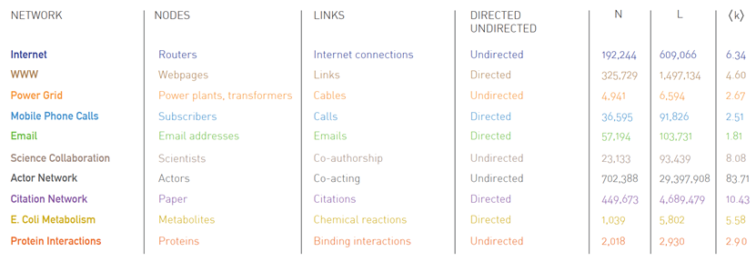
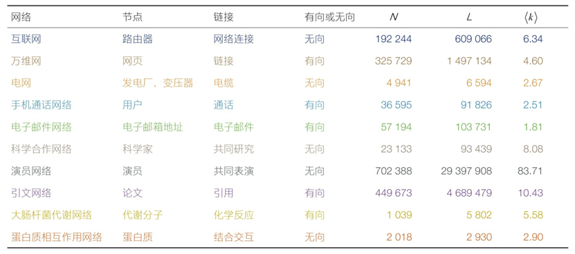

Real network datasets in Network Science Books: A.-L. Barabasi, Network Science. Cambridge University Press, 2016. 

Undirected networks: internet, powergrid, collaboration, actor, protein. The rest are directed networks. 

The information of all networks is as follows:

Download links for the ten datasets: http://networksciencebook.com/translations/en/resources/data.html

中文如下：

