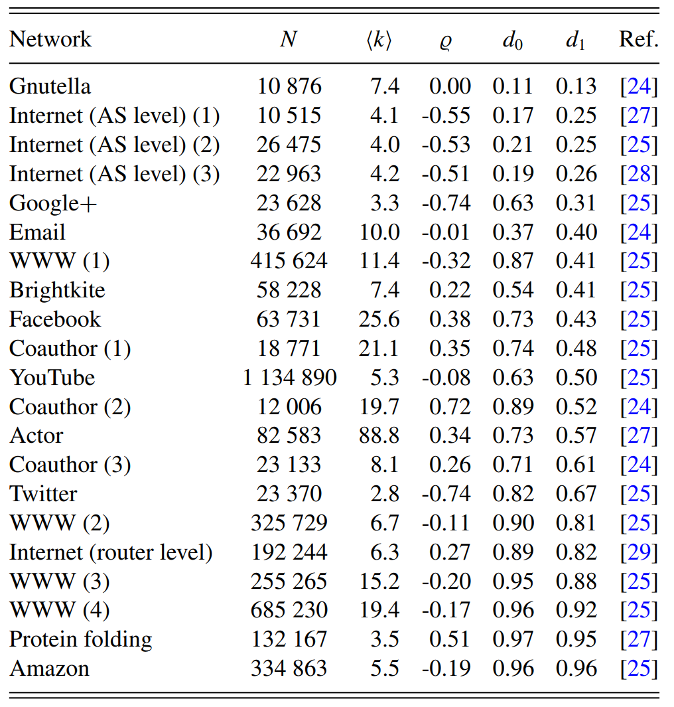

## 该项目收集了复杂网络领域已发表论文(或书籍)中使用的真实网络数据集，并提供了一个简单的Python脚本来构建每个数据对应的网络拓扑结构。后续，该项目会持续更新，数据集的数量会逐渐增加。

## This project collects real network datasets used in published papers in the field of complex networks, and provides a simple Python code script to construct the network topology corresponding to each data.

## In the future, the project will continue to be updated and the number of datasets will gradually increase.

由于无法上传单个大于25M的文件，因此我们仅仅上传了部分网络数据集，并给出了所有网络的下载链接。

（Since it is not possible to upload a single file larger than 25M, we have only uploaded part of the network datasets and provided download links for all networks.）

1、Real network datasets in Network Science Books: A.-L. Barabasi, Network Science. Cambridge University Press, 2016. 

2、Fujiki Y, Yakubo K. Identification of intrinsic long-range degree correlations in complex networks[J]. Physical Review E, 2020, 101(3): 032308.

