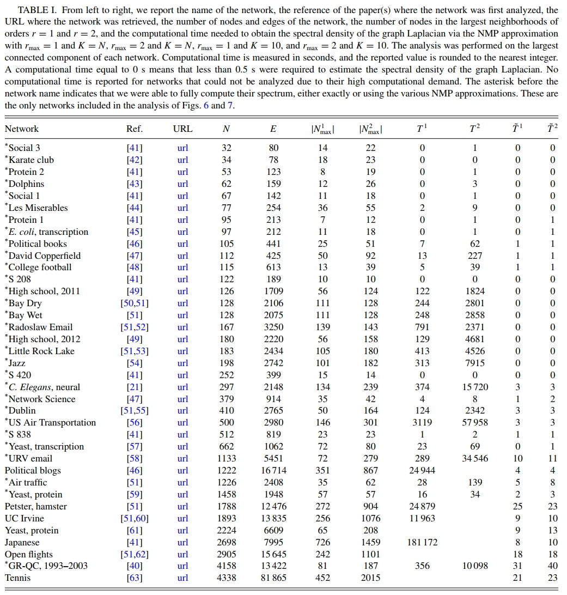

## 复杂网络真实数据集开源项目

### 该项目收集了复杂网络领域已发表论文(或书籍)中使用的真实网络数据集，并提供了一个简单的Python脚本来构建每个数据对应的网络拓扑结构。后续，该项目会持续更新，数据集的数量会逐渐增加。

### This project collects real network datasets used in published papers in the field of complex networks, and provides a simple Python code script to construct the network topology corresponding to each data. In the future, the project will continue to be updated and the number of datasets will gradually increase.

由于无法上传单个大于25M的文件，因此我们仅仅上传了部分网络数据集，并给出了所有网络的下载链接。

（Since it is not possible to upload a single file larger than 25M, we have only uploaded part of the network datasets and provided download links for all networks.）

## Real-world network data information and download URL

1、Real network datasets in Network Science Books: A.-L. Barabasi, Network Science. Cambridge University Press, 2016. 

Download links for the ten datasets: http://networksciencebook.com/translations/en/resources/data.html

2、Fujiki Y, Yakubo K. Identification of intrinsic long-range degree correlations in complex networks[J]. Physical Review E, 2020, 101(3): 032308.
https://doi.org/10.1103/PhysRevE.101.032308

Gnutella 10876  http://snap.stanford.edu/data/p2p-Gnutella04.html

Internet (AS level)(1) 10515  http://cosinproject.eu/extra/data/internet/AS-20010316.graph

Internet (AS level)(2) 26475  http://konect.cc/networks/as-caida20071105/

Internet (AS level)(3) 22963  http://www-personal.umich.edu/~mejn/netdata/

Google+ 23628  http://konect.cc/networks/ego-gplus/

Email 36692  http://snap.stanford.edu/data/email-Enron.html

WWW(1) 415624  http://konect.cc/networks/zhishi-baidu-relatedpages/ (The data in Table 2 of the article is not found. Here is a similar data "zhishi-baidu-relatedpages".)

Brightkite 58228  http://konect.cc/networks/loc-brightkite_edges/

Facebook 63731  http://konect.cc/networks/facebook-wosn-links/

Coauthor (1) 18771  http://konect.cc/networks/ca-AstroPh/

YouTube 1134890  http://konect.cc/networks/com-youtube/

Coauthor (2) 12006  http://snap.stanford.edu/data/ca-HepPh.html

Actor 82583  http://cosinproject.eu/extra/data/actors/imdb.html (The raw data is not accessible, and the corresponding actor network data from the Barabasi Network Science book is used here)

Coauthor (3) 23133  http://snap.stanford.edu/data/ca-CondMat.html

Twitter 23370  http://konect.cc/networks/ego-twitter/

WWW(2) 325729  http://konect.cc/networks/web-NotreDame/

Internet (router level) 192244  http://math.bu.edu/people/kolaczyk/datasets.html

WWW(3) 255265  https://networkrepository.com/web-Stanford.php  (This data could not be found from the URL provided in the article, and we provide another web data)

WWW(4) 685230  http://konect.cc/networks/web-BerkStan/

Protein folding 132167  http://cosinproject.eu/extra/data/folding/

Amazon 334863  http://konect.cc/networks/com-amazon/

3、Han L, Lin Z, Tang M, et al. Impact of contact preference on social contagions on complex networks[J]. Physical Review E, 2020, 101(4): 042308.
https://doi.org/10.1103/PhysRevE.101.042308

Hamsterster friendships   http://konect.cc/networks/petster-friendships-hamster/

U. Rovira i Virgili   http://konect.cc/networks/arenas-email/

4、Sun J, Medo M, Staab S. Time-invariant degree growth in preferential attachment network models[J]. Physical Review E, 2020, 101(2): 022309.
https://journals.aps.org/pre/abstract/10.1103/PhysRevE.101.022309

American Physical Society (APS) citation network：https://journals.aps.org/datasets （这个数据集需要给APS官方发邮件获取，邮件地址为：data-requests@aps.org。笔者之前获取了一份，数据文件400多M，无法在这里上传，需要的可以留言）

DBLP (digital bibliography & library project) data：https://www.aminer.cn/citation

5、Chen D, Su H, Wang X, et al. Finite-size scaling of geometric renormalization flows in complex networks[J]. Physical Review E, 2021, 104(3): 034304.
https://journals.aps.org/pre/abstract/10.1103/PhysRevE.104.034304

Gnutella：http://snap.stanford.edu/data/

AS：http://snap.stanford.edu/data/as.html

CAIDA：http://snap.stanford.edu/data/as-caida.html

Cond-Mat：http://www-personal.umich.edu/~mejn/netdata/

Socfb：https://networkrepository.com/socfb

IG5、TF、Rajat、Cage、Maragal：https://networkrepository.com/misc.php

6、Chen D, Cai D, Su H. Scaling properties of scale-free networks in degree-thresholding renormalization flows[J]. IEEE Transactions on Network Science and Engineering, 2023.
DOI: 10.1109/TNSE.2023.3266381. https://ieeexplore.ieee.org/abstract/document/10100895

数据地址见我们的代码仓库：[https://github.com/cdzqf/DTR](https://github.com/chend2023/DTR)

7、Chen D, Su H. Identification of influential nodes in complex networks with degree and average neighbor degree[J]. IEEE Journal on Emerging and Selected Topics in Circuits and Systems, 2023. DOI: 10.1109/JETCAS.2023.3283680. https://ieeexplore.ieee.org/abstract/document/10145778

数据地址见我们的代码仓库：[https://github.com/cdzqf/identifying_important_nodes](https://github.com/chend2023/identifying_important_nodes)

8、George T. Cantwell, Alec Kirkley, Filippo Radicchi. Heterogeneous message passing for heterogeneous networks. [Phys. Rev. E 108, 034310 (2023)](
https://doi.org/10.1103/PhysRevE.108.034310). 

